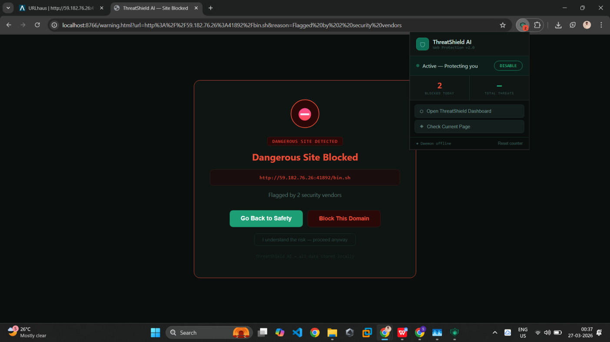

# ThreatShield

**AI-powered cybersecurity for everyday users.**  
Real-time phishing detection · Endpoint sandboxing · Web threat blocking · Browser extension

[](#license)
[](https://python.org)
[](#installation)

</div>

---

## What is ThreatShield?

ThreatShield is an intelligent, always-on security suite that sits silently in the background and protects you from modern cyber threats — phishing emails, malicious downloads, dangerous websites, and suspicious scripts — using machine learning models that **learn from your environment** over time.

It is designed for everyday users, delivering enterprise-grade protection without complexity.

---

## Features

<p align="center">
  
</p>

- Dashboard

### Threat Logs

<p align="center">
  
</p>

- Tracks all detected threats
- Maintains history for analysis

### Email Shield

<p align="center">
  
</p>

- Detects phishing and social-engineering emails in real time
- Flags suspicious sender patterns, spoofed domains, and malicious links
- One-click actions: dismiss, quarantine, or report

### Endpoint Shield

<p align="center">
  
</p>

- Sandboxes suspicious files before they execute
- Behavioural analysis of scripts, executables, and archives
- Automatic quarantine with restore capability

### Sandbox Analysis

<p align="center">
  
</p>

- Executes suspicious files in isolated environment
- Detects malicious behavior before system impact

### Web Shield

<p align="center">
  
</p>

- Custom DNS server blocks known malicious domains
- Local block page served instantly on threat detection
- URL reputation cache for fast repeated lookups

### Quarantine System

<p align="center">
  
</p>

- Safely isolates malicious files
- Allows restore if needed

### Domain Blocking

<p align="center">
  
</p>

- Prevents access to known malicious domains

### Browser Extension

<p align="center">
  
</p>

- Companion extension for Chrome/Chromium
- Warns before visiting flagged URLs
- Syncs with the desktop daemon in real time

### Community Reporting

<p align="center">
  
</p>

- Share and receive threat intelligence

### Adaptive ML Model

- Learns from threats seen in your environment
- Pattern recognition improves over time via `models/learner.py`
- No data is sent to external servers — fully local inference

---

## Architecture

```
main.py                   ← Entry point
├── core/
│   ├── daemon.py         ← Background service manager
│   ├── event_bus.py      ← Internal pub/sub events
│   ├── storage.py        ← Persistent state
│   └── logger.py         ← Structured logging
├── shields/
│   ├── email/            ← Phishing detection engine
│   ├── endpoint/         ← Sandbox & file analysis
│   └── web/              ← DNS + HTTP block server
├── models/
│   └── learner.py        ← Adaptive ML training loop
├── ui/
│   └── app.py            ← Desktop UI (tkinter/custom)
├── extension/            ← Chrome browser extension
└── utils/                ← Notifications, community reporting
```

---

## Installation

## Download

### Windows (Recommended)

Download the latest installer from the [Releases](../../releases) page and run:
`ThreatShield_Setup.exe`.
[](https://github.com/suraj-prasad-rout/ThreatShieldAi/releases)

### From Source

## Run From Source

**Requirements:** Python 3.12+, pip

```bash
git clone https://github.com/suraj-prasad-rout/ThreatShieldAi.git
cd ThreatShieldAi
pip install -r requirements.txt
python main.py
**Requirements:** Python 3.12+, pip

```

### Browser Extension

1. Open `chrome://extensions/` in Chrome
2. Enable **Developer mode**
3. Click **Load unpacked** → select the `extension/` folder

---

## Building

### Windows Executable

```bat
cd build
build_windows.bat
```

### Linux Binary

```bash
cd build
chmod +x build_linux.sh
./build_linux.sh
```

Outputs land in `dist/ThreatShield/`.

---

## Configuration

On first launch, ThreatShield creates `data/config.json` with sensible defaults. You can edit this file or use the Settings panel in the UI.

Key options:

| Key                       | Default            | Description              |
| ------------------------- | ------------------ | ------------------------ |
| `email_shield_enabled`    | `true`             | Toggle email monitoring  |
| `endpoint_shield_enabled` | `true`             | Toggle file sandboxing   |
| `web_shield_enabled`      | `true`             | Toggle DNS blocking      |
| `learn_from_threats`      | `true`             | Enable adaptive learning |
| `quarantine_path`         | `data/quarantine/` | Where flagged files go   |

---

## Testing

```bash
pytest tests/
```

Tests cover phishing detection accuracy (`test_phishing.py`) and storage integrity (`test_storage.py`).

---

## License

ThreatShield is **proprietary software**. All rights reserved.

You may not copy, modify, distribute, sublicense, or reverse-engineer any part of this software without explicit written permission from the author.

See [LICENSE.md](LICENSE.md) for full terms.

## Disclaimer

ThreatShield is a security tool, not a guarantee. It significantly reduces risk but does not replace good security hygiene. Always keep your OS and software updated

<div align="center">

Made with care · © 2026 Suraj Prasad Rout

</div>
